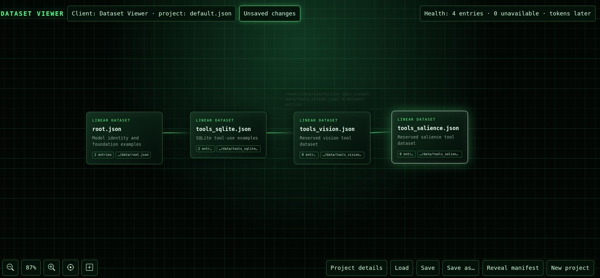

<p align="center">
  
</p>

# Dataset Viewer

Dataset Viewer is a local, visual workspace for planning and inspecting the JSON datasets behind private, tool-capable LLM projects. It is designed for the practical part of the process: keeping several client corpora, their dataset files, and their working layouts understandable while preparing data for future GGUF builds.

The tool is still a work in progress. Suggestions, bug reports, and small improvements are very welcome.

## What it does

- Shows each project as a draggable left-to-right dataset flow on a black-and-green grid.
- Saves a project's node positions, selected node, zoom level, and camera position in its project manifest.
- Supports mouse-wheel zooming, middle-mouse panning, centring on the root node, node renaming, and visual-only notes.
- Displays the active client/project, entry totals, unavailable-file count, and saved/unsaved state.
- Lets you create, search, load, save, and duplicate project manifests.
- Reads each declared JSON dataset to calculate its entry count.
- Opens manifest-declared dataset files in your configured text editor.

## Requirements

- Python 3.10 or newer (the app uses only the Python standard library).
- A modern web browser.
- Optional: a text editor for opening JSON files from the canvas.

## Start Dataset Viewer

From the repository root:

```bash
python3 server.py
```

Then open [http://127.0.0.1:8000](http://127.0.0.1:8000) in a browser.

On Windows, use the Python launcher if needed:

```powershell
py server.py
```

Do not open `index.html` directly from the filesystem: project browsing, saving, health checks, editor opening, and manifest discovery all require the local server.

When changing `index.html`, CSS, JSON datasets, or project manifests, refresh the browser. When changing `server.py`, stop it with `Ctrl+C` and run it again so Python loads the new code.

## Project structure

```text
Dataset Viewer/
├── config.json              # Local editor, theme, active project, UI placement
├── data/                    # Vanilla JSON dataset templates
├── projects/                # Saved project manifests
│   └── default.json          # Starter project
├── css/                      # Green/blue themes and local Bootstrap icons
├── images/main.jpg           # README image
├── index.html                # Browser interface
└── server.py                 # Local Python server
```

### Starter project and data

`projects/default.json` is a starter manifest pointing at the vanilla templates in `data/`. It is expected that you will amend it to match your own files and client corpus. You may also delete it and create your own project from the interface.

The JSON files in `data/` are deliberately basic templates:

- `root.json`
- `tools_sqlite.json`
- `tools_vision.json`
- `tools_salience.json`

Create a project manifest for each client or corpus. A manifest contains the hard-coded paths to its datasets, metadata, and saved canvas layout. Dataset paths can point to other drives as absolute paths, or use project-root-relative paths such as `data/root.json`. If you clone this repository onto another machine, amend any absolute paths.

## Configure the interface

`config.json` is intentionally edited by hand. It controls the active project, theme, preferred editor, and where the interface zones appear.

```json
{
  "last_project": "default",
  "theme": "green-grid.css",
  "editor": {
    "command": "featherpad",
    "arguments": []
  },
  "ui_layout": {
    "identity": "top-left",
    "health": "top-right",
    "canvas_controls": "bottom-left",
    "project_actions": "bottom-right"
  }
}
```

Available themes are `green-grid.css` and `blue-grid.css`. Refresh the browser after changing configuration.

The default studio arrangement keeps project identity top-left, health top-right, compact canvas icons bottom-left, and project actions bottom-right. You can also use `left-dock` or `top-left` for `canvas_controls`, and `bottom-left` for `project_actions`.

## Choose your editor

Double-clicking a dataset node asks the local server to open the file using the editor configured in `config.json`. Only files declared in the active project manifest are allowed.

Examples:

**FeatherPad (Linux)**

```json
"editor": { "command": "featherpad", "arguments": [] }
```

**Visual Studio Code**

```json
"editor": { "command": "code", "arguments": ["--reuse-window"] }
```

**Notepad (Windows)**

```json
"editor": { "command": "notepad.exe", "arguments": [] }
```

The editor command must be installed and available on your system `PATH`.

## Current limitations

- Existing project names are overwritten when saved; there is no version history or backup prompt yet.
- Dataset files are parsed for entry counts, but their training-record schema is not deeply validated yet.
- Unreadable or invalid dataset files are skipped so the rest of a project can load; the health strip reports the count.
- “Add visual node” deliberately creates only a diagram note. It does not create a JSON file.

## Contributing ideas

Useful next steps include safer project backups, JSON/schema validation, token estimates, a failed-file list, and a proper workflow for creating or attaching new dataset files. If you have an idea that would make managing multiple late-night client corpora calmer and faster, please share it.
